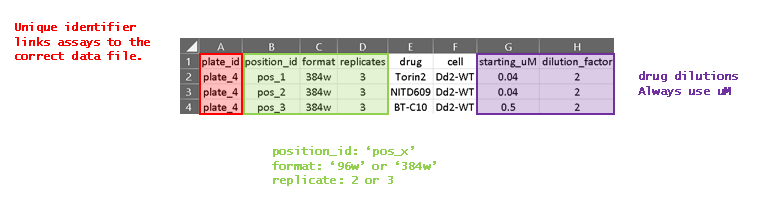
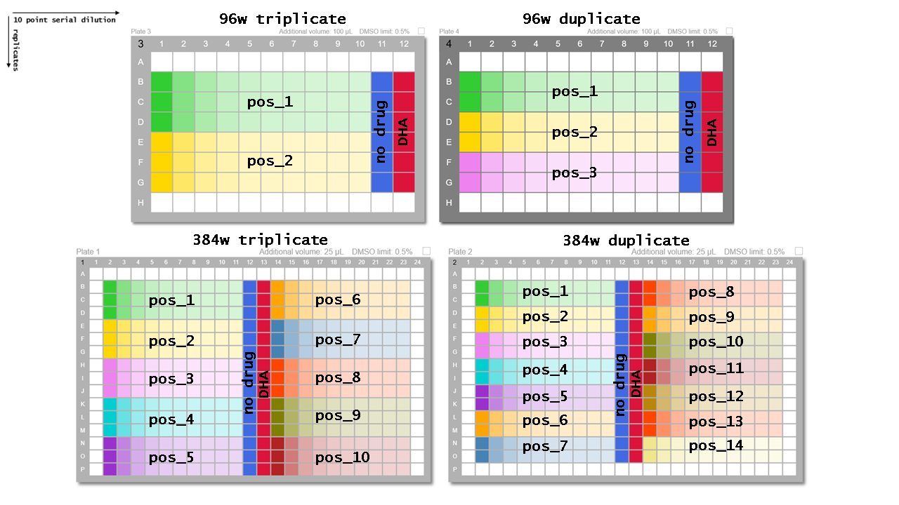

# dose_response_screen

This is an automated tool for dose response modelling of compounds against plasmodium cultures. We use a tecan D300e digital dispenser to print compound dose ranges on to culture plates, we then drop cells on top with a Fisher Scientific multi drop combi. Plates are incubated for 72hrs before being lysed, stained with syber green and read on a Omega FluoStar plate reader. Each plate has a unique identifier added via the Omega protocol.

Fluorescence intensities are automatically generated into ASCII csv files with the prefix 'automated_syber_xxxx.csv'. The unique identifier of each plate is located in row 3, column 1 as 'ID1: <unique identifier>'. Assay information is supplied via a csv file:

 ## Drug Assay Format
 
The tool assumes a left to right 10 point serial dilution, with replicates repeating top to bottom. Typically 96 well assays are 100ul and 384 well assay are 25ul total volume.
 
## Test Data set
A test data set has been provided, I would suggest running this data first to
determine the script works in your environment. Any errors that turn up here will likely be
the result of package version differences. If the test dataset runs fine and you still get
errors, use it to compare your dataset with to identify format errors.

## Output
The main function will return a single csv file with meta data for each assay in the batch,
if the fitting function worked IC50 values will be included. There will also be a pdf of all
assays plotted individually for visual inspection. IC50s should not be assumed correct, a
visual assessment of the data should always be used to determine if the assay has worked as
expected. Additionally, grouped plots are generated for individual compounds in pdf format

The script utilises the dose-response model function from the R drc package.
Ritz, C., Baty, F., Streibig, J. C., Gerhard, D. (2015) Dose-Response Analysis Using R PLOS ONE, 10(12), e0146021
