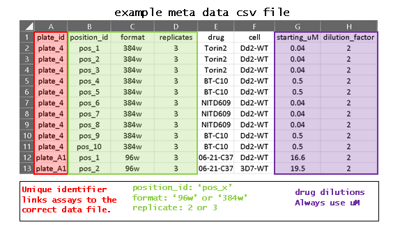

# dose_response_screen

This is an automated tool for dose response modelling of compounds against plasmodium cultures. We use a tecan D300e digital dispenser to print compound dose ranges on to culture plates, we then drop cells on top with a Fisher Scientific multi drop combi. Plates are incubated for 72hrs before being lysed, stained with syber green and read on a Omega FluoStar plate reader. Each plate has a unique identifier added via the Omega protocol.

Fluorescence intenisities are automatically generated into ASCII csv files with the prefix 'automated_syber_xxxx.csv'. The unique identifier of each plate is located in row 3, column 1 as 'ID1: <unique identifier>'. Assay information is supplied via a csv file:

  
  
## Drug Assay Format
